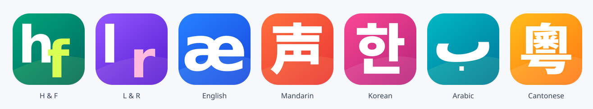

# Seven-app design refresh

The family now includes H & F, L & R, English, Mandarin, Korean, Arabic Letters
and Cantonese. Each has a vivid, full-bleed icon with an oversized glyph and no
small brand text. White panels, compact navigation and two-tone word cards keep
the practice interface uncluttered. The inactive playback dock is hidden on Learn.

## Play without pressure

Each graded contrast can launch a five-question round. Pairs are shuffled without
immediate repetition; available pairs are used before recycling. Listening answers
unlock only after completed playback. Visual-recall lessons retain their visual
mode. Accent-merger/exploration lessons do not become right/wrong games.

One star recognizes completing a round, two recognize three or four correct recall
answers, and three recognize five. Stars are saved separately per app. There is no
timer, lost-life penalty, subscription gate or speech-accuracy reward. Interrupted
rounds restart; earned stars remain. Unavailable storage produces the existing
temporary-storage warning. Audio interruptions and failures do not award answers.

## Learn with optional motion

Tone curves can trace across the diagram; vowel maps highlight relative positions.
Selected English L/R, English/Mandarin H/F and bilabial aspiration lessons use
simple original side-view cues. Animation can be paused and is disabled by the
system reduced-motion setting. These are schematic guides, not anatomical tracking.
See [Cantonese and illustration sources](CANTONESE.md).

## Icon exports

`tools/icons.mjs` generates opaque iOS/store artwork, web favicons/touch icons,
maskable PWA artwork and separate transparent Android adaptive foreground layers
at 108dp per density. A pixel-level regression checks the adaptive safe circle.
The OS applies its own corner mask. The generator uses installed DejaVu Sans and
Noto Sans CJK HK; the native PNG exports are checked in for consistent packaging.
Android sizing follows the [official adaptive-icon specification](https://developer.android.com/develop/ui/compose/system/icon_design_adaptive).

## Validation and release boundary

The validation set covers curriculum/voice selection, game reward persistence,
audio cancellation, platform icon exports, 320px/390px phone layouts, iPad-sized
layouts, reduced motion, original playback/recording/history regressions, seven
web builds, Android debug compilation and unsigned iOS simulator compilation.
Browser speech is mocked to test UI lifecycle, not actual voice quality.

This source update is not a store upload or a public web deployment. The existing
six TestFlight/Play internal builds remain 0.1.0 (1). Cantonese needs a separate
store record and release preparation. Version/build numbers must be advanced for
the existing apps before another upload. Real-device audio checks and human
speech-score validation remain open; compilation does not establish either.
